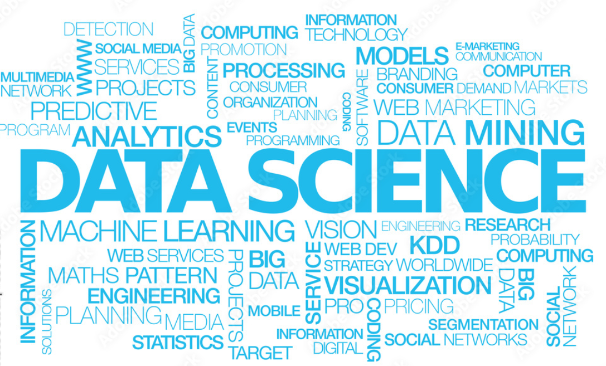

# :bulb: Grufflers Data Science Career Roadmap :car:

## Phase 1: Foundation (3-6 months)

### 1.1 Python Proficiency
- Learn Python programming language. [Python.org](https://www.python.org/) | [Codecademy Python Course](https://www.codecademy.com/learn/learn-python-3)
- Practice DSA's / Data Engineering [LeetCode Data Engineering Study Plan](https://leetcode.com/studyplan/leetcode-75/) 

### 1.2 Mathematics and Statistics
- Brush up on fundamental concepts like linear algebra, calculus, and statistics. [Khan Academy](https://www.khanacademy.org/math) | [Coursera - Mathematics for Machine Learning](https://www.coursera.org/specializations/mathematics-machine-learning)

### 1.3 Data Analysis and Visualization
- Learn data analysis with libraries like Pandas and data visualization with Matplotlib/Seaborn. [Pandas Documentation](https://pandas.pydata.org/docs/) | [Matplotlib Documentation](https://matplotlib.org/stable/contents.html)

### 1.4 SQL Fundamentals
- Gain a basic understanding of SQL for data retrieval and manipulation. [SQLZoo](https://sqlzoo.net/) | [Coursera - SQL for Data Science](https://www.coursera.org/specializations/ibm-data-science)

## Phase 2: Data Science Core (6-9 months)

### 2.1 Machine Learning
- Study machine learning algorithms and techniques. [Coursera's Machine Learning by Andrew Ng](https://www.coursera.org/learn/machine-learning) | [Scikit-Learn Documentation](https://scikit-learn.org/stable/)

### 2.2 Data Science Libraries
- Learn libraries like Scikit-Learn for machine learning and Jupyter notebooks for experimentation. [Jupyter Notebook Documentation](https://jupyter-notebook.readthedocs.io/en/stable/) | [Kaggle](https://www.kaggle.com/)

### 2.3 Data Wrangling
- Enhance data cleaning and preprocessing skills. Real-world datasets on [Kaggle](https://www.kaggle.com/) | Data cleaning guide on [DataCamp](https://www.datacamp.com/community/tutorials/data-cleaning-python-r)

### 2.4 Exploratory Data Analysis (EDA)
- Practice EDA techniques to gain insights from data. Kaggle kernels | [Seaborn Documentation](https://seaborn.pydata.org/)

## Phase 3: Advanced Topics (6-12 months)

### 3.1 Specialize in AWS Data Science (Optional)

   #### 3.1.1 AWS Basics
   - Learn AWS fundamentals and services. [AWS Certified Cloud Practitioner Training](https://aws.amazon.com/certifications/cloud-practitioner/) | [AWS Documentation](https://docs.aws.amazon.com/)

   #### 3.1.2 AWS Data Analytics
   - Explore AWS data analytics services like Amazon Redshift, Glue, and Athena. AWS training and documentation for each service.

### 3.2 Specialize in Database Administration (Optional)

   #### 3.2.1 Database Fundamentals
   - Study relational database concepts and management. [Coursera - Introduction to Databases](https://www.coursera.org/specializations/introduction-to-databases) | [SQLCourse](https://www.sqlcourse.com/)

   #### 3.2.2 Database Technologies
   - Learn about specific database technologies (e.g., MySQL, PostgreSQL, MongoDB). [MongoDB University](https://university.mongodb.com/) | [MySQL Documentation](https://dev.mysql.com/doc/)

## Phase 4: Portfolio Development (Ongoing)

- Create a portfolio of data science projects, showcasing skills and expertise. Host your projects on [GitHub](https://github.com/) and consider using [GitHub Pages](https://pages.github.com/) for a personal website/blog.

## Phase 5: Job Search (Ongoing)

- Tailor the resume and LinkedIn profile to highlight relevant skills and projects. Search for job opportunities on platforms like [LinkedIn](https://www.linkedin.com/), [Indeed](https://www.indeed.com/), and [Glassdoor](https://www.glassdoor.com/).

## Phase 6: Continuous Learning (Ongoing)

- Stay updated with the latest trends and advancements in data science and related fields. Consider enrolling in advanced courses on platforms like [Coursera](https://www.coursera.org/) and [edX](https://www.edx.org/). Follow data science blogs like [KDnuggets](https://www.kdnuggets.com/) for industry insights.

[Best Data Science Bootcamps](https://www.coursereport.com/best-data-science-bootcamps)